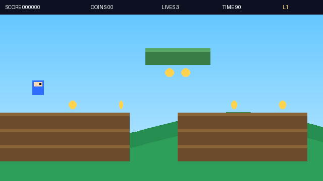

# Cairn Runner

A tiny but complete Mario-style side-scrolling platformer in **vanilla
HTML/CSS/JS** (ES modules, no build step, no libraries, no downloaded assets).
All art is drawn with canvas shapes. Drop it on GitHub Pages and it just runs.



> **About this GIF.** `docs/gameplay.gif` shipped in this repo is a *synthetic
> preview*: it is rendered by [`tools/render_gif.py`](tools/render_gif.py),
> which re-implements the game's exact physics constants, collision model and
> camera in Python and drives a simple auto-player, then rasterizes frames with
> Pillow. It is **not** a screen recording of the browser game — it's a faithful
> re-render for documentation. To capture *real* footage of the actual game,
> follow **Generate a real gameplay GIF** below.

## Features

- Title screen, pause, win/lose, restart
- **2 levels**, string-based tilemaps, easy to edit/add
- Run · jump (with coyote-time + jump-buffer + variable height) · gravity
- AABB tile collisions, platforms, pits, spikes
- Patrolling enemies (turn at walls/ledges), stomp-to-kill or take damage
- Coins, checkpoints, end flag, time bonus
- HUD: score / coins / lives / time / level
- Camera follows the player, clamped to level bounds, with parallax hills
- **Sprite-based rendering** (Kenney CC0 pack) with automatic shape fallback
- Layered parallax background: gradient sky, drifting clouds, mountains, hills
- Animated player (idle/walk/jump) and enemies; built-in sprite-picker debug overlay
- Web Audio sound effects + mute
- Keyboard (Arrows/WASD + Space) **and** on-screen touch buttons
- Fixed-timestep 60 FPS loop, viewport tile culling, pause-on-blur

## Graphics & assets

The game renders with **real sprite art** when you add a spritesheet, and falls
back to simple canvas shapes when none is present — so it always runs.

**To turn on the full pixel-art look** (free, CC0, ~250 kB):

1. Download Kenney's **Pixel Platformer** pack: <https://kenney.nl/assets/pixel-platformer>
   (CC0 1.0 — usable anywhere, no attribution required).
2. Unzip it, then copy two files into `assets/` and rename:

   | From the pack                              | Rename to                |
   |--------------------------------------------|--------------------------|
   | `Tilemap/tilemap_packed.png`               | `assets/tiles.png`       |
   | `Tilemap/tilemap-characters_packed.png`    | `assets/characters.png`  |

3. Reload. Tiles, player, enemies, coins, and flag now use the sprites.

The background (sky gradient, parallax clouds/mountains/hills) is drawn
procedurally, so it layers nicely behind whatever sprite pack you use.

### If a sprite looks wrong (wrong cell)

Sprite positions are mapped in `src/engine/assets.js` (`TILES` and `CHARS` —
each is a `[col, row]` into the sheet). Different pack versions can shift these.
Use the built-in **sprite picker** to find the right cell:

- Open `…/?pick=tiles` or `…/?pick=chars` — it overlays the sheet with a labelled
  `col,row` grid. Read the cell you want and edit the mapping in `assets.js`.

### Using your own art

Any spritesheet works. Set the cell size and grid in `SHEET` (in `assets.js`),
then point `TILES`/`CHARS` at the cells you want. Nothing else changes.

## Run locally

ES modules need to be served over HTTP (opening `index.html` via `file://`
will be blocked by the browser). Pick any one:

```bash
# Python 3
python3 -m http.server 8000

# Node (no install)
npx serve .
```

Then open <http://localhost:8000>.

## Deploy to GitHub Pages

1. Push this repo to GitHub.
2. Repo **Settings → Pages**.
3. **Source:** Deploy from a branch. **Branch:** `main`, folder `/ (root)`.
4. Save. Your game appears at `https://<user>.github.io/<repo>/` in ~1 minute.

No build step — the files are served as-is.

## Controls

| Action  | Keys                         | Touch        |
|---------|------------------------------|--------------|
| Move    | ← → / A D                    | ◀ ▶ buttons  |
| Jump    | ↑ / W / Space                | ⤴ button     |
| Pause   | P                            | ⏸ button     |
| Mute    | M                            | 🔊 button     |
| Restart | R                            | —            |
| Start   | Enter / Space                | tap ⤴        |

## Add or edit a level

Levels are plain string arrays in [`src/levels/`](src/levels/). Each character
is one tile; **every row must be the same length.**

| Char | Meaning            |
|------|--------------------|
| `.`  | empty              |
| `#`  | solid ground       |
| `=`  | solid platform     |
| `C`  | coin               |
| `E`  | enemy spawn        |
| `P`  | player spawn       |
| `K`  | checkpoint         |
| `F`  | end flag           |
| `^`  | spikes (damage)    |

To **add** a level:

1. Copy `src/levels/level2.js` to `level3.js` and edit the `map`.
2. In `src/main.js`, import it and add it to the `LEVEL_DEFS` array:
   ```js
   import L3 from './levels/level3.js';
   const LEVEL_DEFS = [L1, L2, L3];
   ```

Tune feel (gravity, jump, speeds) in `src/engine/constants.js`.

## Generate a real gameplay GIF

The game ships with a **recording mode** that plays a fixed scripted demo, so
every capture looks the same.

1. Start a local server (see above) and open:
   <http://localhost:8000/?demo=1>
2. Record the canvas for ~12 seconds. Easiest no-install options:
   - **macOS:** `Cmd+Shift+5` → record a region over the game → save `.mov`.
   - **Windows:** `Win+G` (Game Bar) → record → save `.mp4`.
   - **Any OS:** a browser screen-recorder extension exporting `.webm`.
3. Convert the recording to `docs/gameplay.gif` with the included script
   (needs [ffmpeg](https://ffmpeg.org/download.html)):

   ```bash
   # macOS / Linux / WSL / Git Bash
   ./tools/gif.sh recording.webm

   # Windows PowerShell
   .\tools\gif.ps1 recording.mp4
   ```

4. Commit `docs/gameplay.gif`. The README image tag already points at it.

## Regenerate the synthetic preview GIF (no browser needed)

The committed `docs/gameplay.gif` is produced headlessly — handy for CI or quick
docs refreshes. It needs only Python + Pillow (`pip install Pillow`):

```bash
python3 tools/render_gif.py
```

This reads `src/levels/level1.js` directly (so the preview can't drift from the
real level), mirrors the engine's physics, runs a gap-aware auto-player to the
flag, and writes `docs/gameplay.gif`. Again: this is a re-render, not a recording
of the browser build — prefer the real method above for anything user-facing.

## Known limitations

- No persistence/high scores (no `localStorage` used).
- Single enemy type; no moving platforms or power-ups (scope kept tight).
- Touch controls are basic two-direction + jump.
- Demo/recording mode uses a simple gap-aware auto-player; it handles normal
  layouts but won't solve puzzle-like levels that need precise timing.
- The GIF itself is not committed — you generate it locally.

## Project structure

```
.
├── index.html
├── styles.css
├── .gitignore
├── docs/
│   └── README.md          # gameplay.gif lives here once generated
├── assets/
│   └── README.md          # where to drop the Kenney sprite sheets
├── tools/
│   ├── gif.sh             # ffmpeg recording -> GIF (bash)
│   ├── gif.ps1            # ffmpeg recording -> GIF (PowerShell)
│   └── render_gif.py      # headless synthetic-preview GIF (Pillow)
└── src/
    ├── main.js            # state machine + fixed-timestep loop
    ├── engine/
    │   ├── constants.js   # all tunables + tile legend
    │   ├── input.js       # keyboard + touch, scroll prevention
    │   ├── demo.js        # gap-aware auto-player for recording mode
    │   ├── assets.js      # spritesheet loader + atlas (Kenney mapping)
    │   ├── spritepicker.js# debug overlay to find sprite cells
    │   ├── audio.js       # Web Audio SFX + mute
    │   ├── physics.js     # AABB tile collision
    │   ├── levels.js      # string map -> grid + spawns
    │   ├── entities.js    # Player, Enemy
    │   └── renderer.js    # sprite + shape drawing, camera, HUD, screens
    └── levels/
        ├── level1.js
        └── level2.js
```

## License

MIT — do what you like.
